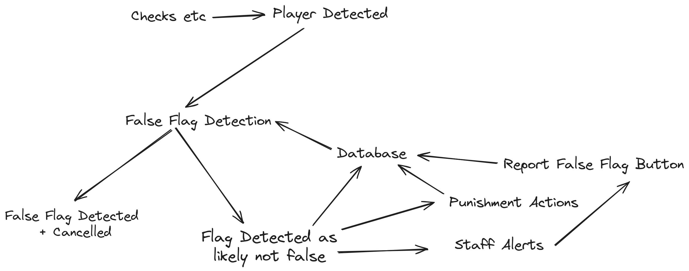

Apollo False Flag Detection uses machine learning to detect false flags based on data from the alerts, and reported false flags using buttons in ban delays, or on punishments.

Completely preventing reported false flags from flagging after certain thresholds, configurable in the config.

This feature is enhanced greatly by the [Remote Data Management Addon](/Apollo/Addons/RemoteDataManagement).

## Concept Map

