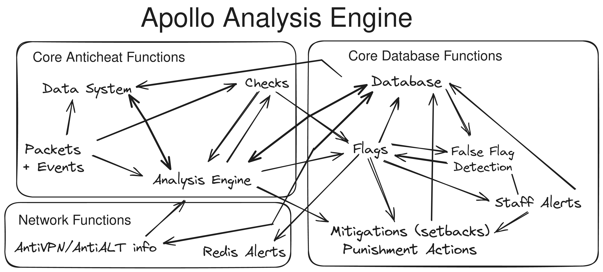

# Apollo Player Analysis
Apollo Player Analysis is an advanced data analysis system used by Apollo to analyse data, detect cheaters faster and ensure accuracy.
Apollo Player Analysis integrates with the database, false flag detection system, data management system and checks to provide high quality output. 
This system also does not output any visible data to staff, as it runs completely in the background.

