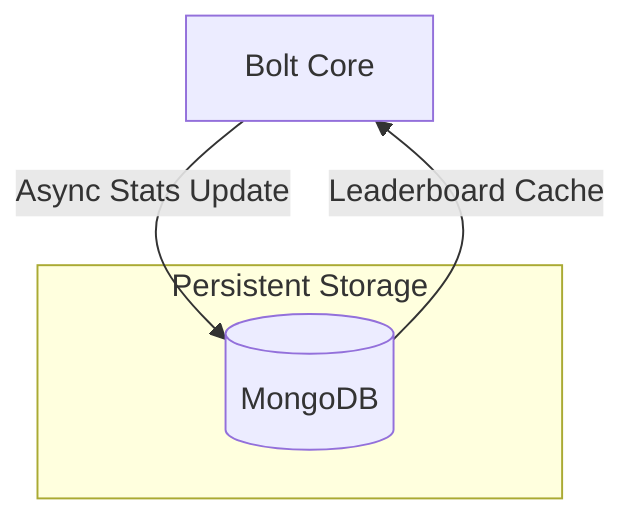

import Tabs from '@theme/Tabs'
import TabItem from '@theme/TabItem'

# MongoDB Architecture & Setup

Bolt utilizes **MongoDB** as its primary persistence layer. It is responsible for storing match results, player statistics (ELO, wins/losses), and arena configurations.

---

## 1. System Overview

Bolt's performance is heavily dependent on database latency. A well-configured MongoDB instance ensures smooth stat updates and lightning-fast leaderboard recalculations.



---

## 2. Deployment Strategies

<Tabs queryString="platform">
<TabItem value="linux" label="Linux (SSH)" default>

### Step 1: Install MongoDB 7.0
```bash
sudo apt update && sudo apt install gnupg wget apt-transport-https ca-certificates -y
wget -qO- https://www.mongodb.org/static/pgp/server-7.0.asc | sudo gpg --dearmor | sudo tee /usr/share/keyrings/mongodb-server-7.0.gpg > /dev/null
echo "deb [ arch=amd64,arm64 signed-by=/usr/share/keyrings/mongodb-server-7.0.gpg ] https://repo.mongodb.org/apt/ubuntu jammy/mongodb-org/7.0 multiverse" | sudo tee /etc/apt/sources.list.d/mongodb-org-7.0.list
sudo apt update && sudo apt install -y mongodb-org
sudo systemctl enable --now mongod
```

### Step 2: Access Control
```javascript
// Access shell with 'mongosh'
use admin
db.createUser({
  user: "boltUser",
  pwd: "YourSecurePassword",
  roles: [ "readWriteAnyDatabase" ]
})
```
</TabItem>

<TabItem value="pterodactyl" label="Pterodactyl Panel">

### Using Container Documentation
:::tip Recommended Egg
**Link:** [MongoDB Pterodactyl Egg](https://pterodactyleggs.com/egg/68a875cc3b8d86e66fb92aa1)
:::

1. Import the egg and create a dedicated MongoDB server.
2. Assign a static IP/Port.
3. Use the Gateway IP `172.18.0.1` if Bolt is on the same machine.

</TabItem>
</Tabs>

---

## 3. Configuration

Enter your credentials in Bolt's `database.yml`.

```yaml
MONGO:
  URI-MODE: false # Use false for standard entry
  URL-ENCODE: false # Set to true if password contains (@, :, $)
  NORMAL:
    HOST: "121.2.3.4" # Change this to your DB IP
    PORT: 27017
    DATABASE: "bolt"
    AUTHENTICATION:
      ENABLED: true
      USERNAME: "boltUser"
      PASSWORD: "YourSecurePassword"
```

---

## 4. Operational Best Practices

### Backup & Disaster Recovery
For production networks, we recommend daily backups of the `bolt` collection:
```bash
mongodump --db bolt --out /backups/$(date +%F)
```

### Performance Monitoring
Connect to the database using [MongoDB Compass](https://www.mongodb.com/products/compass) to visualize query times and index performance.

:::important Indexing
Bolt automatically manages most indexes, but ensuring your disk has high IOPS (SSD/NVMe) will significantly improve arena loading and leaderboard performance.
:::
