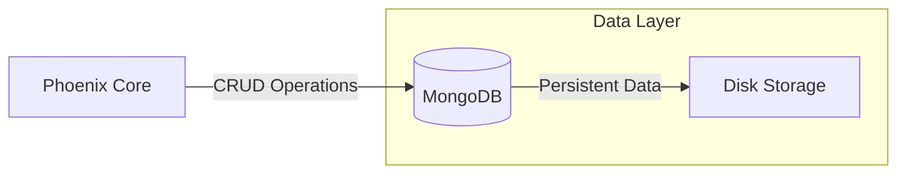

import Tabs from '@theme/Tabs'
import TabItem from '@theme/TabItem'

# MongoDB Architecture & Setup

MongoDB serves as the **source of truth** for Phoenix. It stores mission-critical data including player profiles, hierarchical rank structures, and network-wide configurations.

---

## 1. System Architecture

Phoenix interacts with MongoDB through a persistent high-performance driver. For optimal performance, the database should be geographically close to your game servers.



---

## 2. Infrastructure Setup

### Local Node Installation (Linux)

For high-traffic networks, we recommend a dedicated MongoDB instance.

#### Step 1: Package Repository Initialization
```bash
sudo apt update && sudo apt install gnupg wget apt-transport-https ca-certificates -y
wget -qO- https://www.mongodb.org/static/pgp/server-7.0.asc | sudo gpg --dearmor | sudo tee /usr/share/keyrings/mongodb-server-7.0.gpg > /dev/null
echo "deb [ arch=amd64,arm64 signed-by=/usr/share/keyrings/mongodb-server-7.0.gpg ] https://repo.mongodb.org/apt/ubuntu jammy/mongodb-org/7.0 multiverse" | sudo tee /etc/apt/sources.list.d/mongodb-org-7.0.list
```

#### Step 2: Deployment
```bash
sudo apt update
sudo apt install -y mongodb-org
sudo systemctl enable --now mongod
```

### Pterodactyl Containerization
If you prefer containerized management via Pterodactyl:

:::tip Recommendation
Use the official Refine community egg for streamlined management and automated backups.
**Download:** [MongoDB Pterodactyl Egg](https://pterodactyleggs.com/egg/68a875cc3b8d86e66fb92aa1)
:::

---

## 3. Security Hardening

Unprotected MongoDB instances are frequent targets for ransomware. Implement these measures immediately:

### Role-Based Access Control (RBAC)
1. Access the mongo shell: `mongosh`
2. Create the admin user:
```javascript
use admin
db.createUser({
  user: "phoenixAdmin",
  pwd: "YourStrongPassword",
  roles: [ { role: "userAdminAnyDatabase", db: "admin" }, "readWriteAnyDatabase" ]
})
```

### Network Isolation
Edit `/etc/mongod.conf` and ensure `bindIp` is restricted:
```yaml
net:
  port: 27017
  bindIp: 127.0.0.1,172.18.0.1 # Local and Docker Gateway
```

---

## 4. Phoenix Integration

Apply these settings in your `globa.yml`.

```yaml
database:
  database-type: "MongoDB"
  mongo:
    uri-mode: false
    address: "172.18.0.1" # Standard Pterodactyl Gateway
    port: 27017
    database: "phoenix"
    authentication: true
    username: "phoenixAdmin"
    password: "YourStrongPassword"
```

---

## 5. Troubleshooting

| Symptom | Probable Cause | Solution |
| :--- | :--- | :--- |
| `Connection timed out` | Firewall or wrong BindIP | Ensure port 27017 is open and BindIP includes the gateway IP. |
| `Authentication failed` | Wrong credentials or DB | Verify `authSource` in URI or check username/password accuracy. |
| `Socket error` | MongoDB service down | Check status with `systemctl status mongod`. |

:::warning Note on Gateways
When running Phoenix and MongoDB on the same Pterodactyl node, **always** use `172.18.0.1`. Using public IPs will cause unnecessary latency and potential loopback failures.
:::
