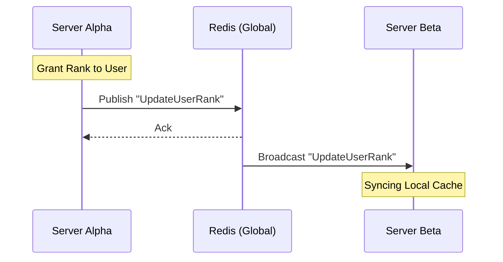

# Redis Synchronization Engine

Redis is the high-speed **messaging backbone** of your network. It facilitates instant cross-server communication, global chat broadcasts, and real-time synchronization of punishments and global staff messages.

---

## 1. Interaction Logic

Phoenix utilizes the **Pub/Sub** (Publish/Subscribe) pattern to ensure that an action taken on one server (like a rank grant) is instantly reflected across all other servers in the network.



---

## 2. Global Deployment

### Linux Bare Metal Installation
Standard installation for Ubuntu 22.04+ or Debian 11+.

```bash
sudo apt update
sudo apt install redis-server -y
sudo systemctl enable --now redis-server
```

### Pterodactyl Environment
For isolated environments, utilize a dedicated Redis server.

:::tip Pterodactyl Egg
**Official Link:** [Redis Pterodactyl Egg](https://pterodactyleggs.com/egg/673601c74924a4e9bbd4ce7b)
:::

1. **Memory Limits:** Ensure the server has at least 128MB of RAM for basic sync, though 512MB is recommended for large networks.
2. **Persistence:** In the **Startup** variables, ensure `SAVE` is configured if you want Redis to persist data across reboots (though Phoenix primarily uses Redis for transient messaging).

---

## 3. Advanced Configuration

### Resource Optimization
Edit `/etc/redis/redis.conf` for maximum efficiency:

```conf
# Performance Tweaks
maxmemory 512mb
maxmemory-policy allkeys-lru
tcp-keepalive 300
```

### Networking & Security
If Phoenix servers connect from different physical machines:
```conf
# Bind to all interfaces (use firewall to restrict!)
bind 0.0.0.0
# Set a strong password
requirepass Your_Complex_Redis_Password_Here
```

---

## 4. Phoenix Integration

Apply these settings in your `globa.yml`.

```yaml
redis:
  address: "172.18.0.1" # Internal gateway
  port: 6379
  username: "default"   # Default user for Redis 6.0+
  password: "Your_Complex_Redis_Password_Here"
  database: 0
```

---

## 5. Maintenance & Diagnostics

| Command | Action | Output |
| :--- | :--- | :--- |
| `redis-cli ping` | Connection test | `PONG` |
| `redis-cli monitor` | View live traffic | Real-time command log |
| `redis-cli info memory` | Check RAM usage | Memory stats |

:::danger Warning
Never expose Redis to the public internet (port 6379) without a strong password and firewall rules. Redis is designed for performance, not security, and can be easily exploited if left open.
:::
