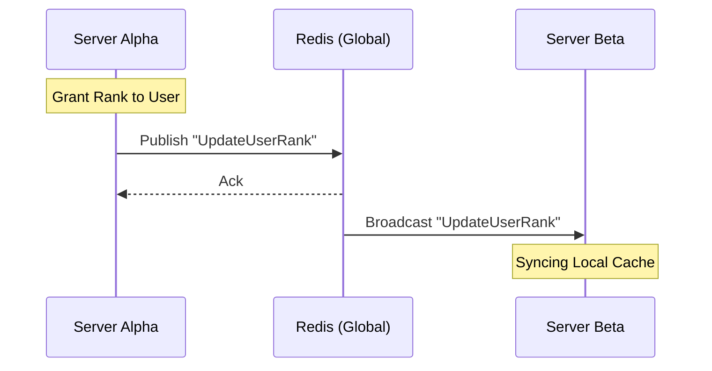

# Redis Synchronization Engine

Redis is the high-speed **messaging backbone** of your network. It facilitates instant cross-server communication, global chat broadcasts, and real-time synchronization of punishments and global staff messages.

:::tip Running a single server?
You don't need Redis if Phoenix runs on one Spigot/Paper server with no proxy. See [Running without Redis](#6-running-without-redis-single-server).
:::

---

## 1. Interaction Logic

Phoenix utilizes the **Pub/Sub** (Publish/Subscribe) pattern to ensure that an action taken on one server (like a rank grant) is instantly reflected across all other servers in the network.


```mermaid
sequenceDiagram
    participant S1 as Server Alpha
    participant R as Redis (Global)
    participant S2 as Server Beta
    Note over S1: Grant Rank to User
    S1->>R: Publish "UpdateUserRank"
    R-->>S1: Ack
    R->>S2: Broadcast "UpdateUserRank"
    Note over S2: Syncing Local Cache
```

---

## 2. Global Deployment

### Linux Bare Metal Installation
Standard installation for Ubuntu 22.04+ or Debian 11+.

```bash
sudo apt update
sudo apt install redis-server -y
sudo systemctl enable --now redis-server
```

### Pterodactyl Environment
For isolated environments, utilize a dedicated Redis server.

:::tip Pterodactyl Egg
**Official Link:** [Redis Pterodactyl Egg](https://pterodactyleggs.com/egg/673601c74924a4e9bbd4ce7b)
:::

1. **Memory Limits:** Ensure the server has at least 128MB of RAM for basic sync, though 512MB is recommended for large networks.
2. **Persistence:** In the **Startup** variables, ensure `SAVE` is configured if you want Redis to persist data across reboots (though Phoenix primarily uses Redis for transient messaging).

---

## 3. Advanced Configuration

### Resource Optimization
Edit `/etc/redis/redis.conf` for maximum efficiency:

```conf
# Performance Tweaks
maxmemory 512mb
maxmemory-policy allkeys-lru
tcp-keepalive 300
```

### Networking & Security
If Phoenix servers connect from different physical machines:
```conf
# Bind to all interfaces (use firewall to restrict!)
bind 0.0.0.0
# Set a strong password
requirepass Your_Complex_Redis_Password_Here
```

---

## 4. Phoenix Integration

Apply these settings in your `global.yml`.

```yaml
redis:
  enabled: true         # false runs a single server without Redis
  address: "172.18.0.1" # Internal gateway
  port: 6379
  username: "default"   # Default user for Redis 6.0+
  password: "Your_Complex_Redis_Password_Here"
  database: 0
```

---

## 5. Maintenance & Diagnostics

| Command | Action | Output |
| :--- | :--- | :--- |
| `redis-cli ping` | Connection test | `PONG` |
| `redis-cli monitor` | View live traffic | Real-time command log |
| `redis-cli info memory` | Check RAM usage | Memory stats |

:::danger Warning
Never expose Redis to the public internet (port 6379) without a strong password and firewall rules. Redis is designed for performance, not security, and can be easily exploited if left open.
:::

---

## 6. Running without Redis (single server)

If Phoenix runs on **one Spigot/Paper server with no proxy**, you can skip installing Redis. Phoenix then keeps the state it would normally share through Redis on that server instead.

```yaml
redis:
  enabled: false
```

On startup the console confirms it with:

```
Redis is off in global.yml, so shared state stays on this server. This only works for a single server.
```

You still need MongoDB or MySQL. Only Redis becomes optional.

### What is kept, and where

Phoenix saves this state to `plugins/Phoenix/local-store.json` every 5 minutes and when the server stops, and loads it again on startup. Vanish, freeze and panic state, the Anti-VPN whitelist, the report watchlist, report rewards and notification read marks all survive a restart, just as they would with Redis.

A few things are rebuilt on every start and are never saved: the profile cache, the server list, setup locks and ban-wave claims.

:::info If the file is damaged
If `local-store.json` can't be parsed, Phoenix moves it aside as `local-store.json.broken-<timestamp>` and starts with an empty store. It never deletes it. If the file exists but can't be read at all (for example, another program has it locked), Phoenix refuses to start rather than overwrite it.
:::

### Limits

- **Spigot/Paper only.** Velocity, BungeeCord and the REST API always need Redis. They refuse to start with `redis.enabled: false` and say so in the console.
- **One server.** Nothing crosses to another server in this mode. Before you add a second server or a proxy, install Redis and set `enabled: true` on every server.
- **No migration.** The contents of `local-store.json` are not copied into Redis when you switch it back on.

### Checking it

`/phoenix setup` and `/phoenix doctor` list Redis under **Storage** as off, and `/phoenix setup` reminds you to turn it on before adding a server. `/phoenix setup database` tests your MongoDB or MySQL connection and marks Redis as skipped.
