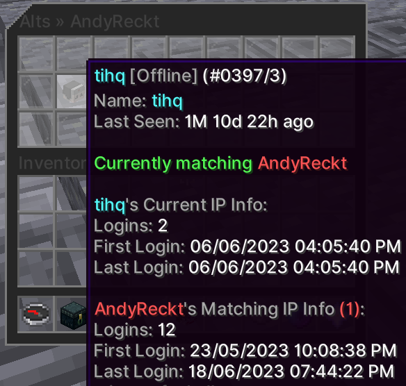

# Alt detection

Phoenix scores how likely it is that two accounts belong to the same person, and
stores the result as a **link** between them. Every link carries a confidence from
0 to 100 and a list of the signals that produced it, so staff can see *why* two
accounts were connected rather than just that they were.

Links are shared network-wide. Scoring runs on join, throttled by
`ALTS.REFRESH_THROTTLE` (default `10m`).

## Confidence

A link's score decides what happens to it. Four thresholds, all under
`SERVER.ALTS.THRESHOLDS`:

Threshold  | Default | What it does
---------- | ------- | ---------------------------------------------------------
`DISPLAY`  | 25      | Minimum score to appear in `/alts`.
`LINK`     | 50      | Minimum score to be written into the profile's alt list.
`ALERT`    | 50      | Minimum score to notify staff of possible ban evasion.
`ENFORCE`  | 75      | Minimum score to automatically kick for ban evasion.

`/alts` groups results by tier so the strongest links read first:

Tier      | Score
--------- | --------
Confirmed | 90 – 100
Likely    | 75 – 89
Possible  | 50 – 74
Weak      | below 50

## Evidence

Scoring splits into address evidence and everything else.

**Address evidence** is the strong half. A clean exact-address match is worth
`SCORE.IP_WEIGHT` (85) on its own, but that figure is damped by how busy the
address is — a household of four scores very differently from a school gateway
with three hundred accounts behind it. Sharing several *independent subnets*
raises confidence; sharing many addresses inside one subnet barely does, because
provider pools move players around (`SUBNET_STACK_DECAY`). Known VPN exits are
worth almost nothing (`VPN_TRUST_MULTIPLIER`, 0.05).

**Non-address signals** are capped as a group by `SIGNALS.NON_IP_CAP` (60),
deliberately below `ENFORCE`, so they can never auto-kick on their own:

Signal | Weight key | Default | What it looks for
------ | ---------- | ------- | -----------------
Alternation | `ALTERNATION_WEIGHT` | 35 | The accounts repeatedly log in right after the other logs out.
Fingerprint | `FINGERPRINT_WEIGHT` | 25 | Identical client settings, locale, view distance and brand.
Logout location | `LOCATION_WEIGHT` | 25 | Logging out in the same spot. Busy spots like spawn count for less.
Ban appearance | `BAN_APPEAR_WEIGHT` | 20 | A new account appears shortly after the other was banned.
Name similarity | `NAME_WEIGHT` | 20 | Similarity below `NAME_FLOOR` (0.60) contributes nothing.
Skin | `SKIN_WEIGHT` | 20 | Shared skin, worth less the more accounts share it.
Play rhythm | `RHYTHM_WEIGHT` | 10 | Everyone in a region plays at similar hours, so this is worth little. Floor `RHYTHM_FLOOR` (0.85).
Latency | `LATENCY_WEIGHT` | 8 | Round-trip times within `LATENCY_TOLERANCE_MS` (15ms).
Concurrency | `CONCURRENCY_PENALTY` | −20 | Points *removed* when both accounts are online at once, which usually means two people.

Each signal reaches full points at a saturation count, and rarity-based signals
stop counting once too many accounts share the same value:

Key | Default | Meaning
--- | ------- | -------
`FULL_HANDOFFS` | 5 | Handoffs for full alternation points.
`FULL_HANDOFF_RATIO` | 0.25 | Share of the shallower account's sessions that must be handoffs.
`HANDOFF_WINDOW` | `5m` | How close a logout and the next login must be to count as a handoff.
`BAN_APPEAR_WINDOW` | `7d` | How soon after a ban a new account must appear.
`FINGERPRINT_RARE_AT` | 4 | Accounts sharing a fingerprint before it stops being evidence.
`SKIN_RARE_AT` | 3 | Same, for skins.
`LOCATION_RARE_AT` | 3 | Same, for logout spots.
`FULL_SHARED_LOCATIONS` | 2 | Shared logout spots for full location points.
`FULL_CONCURRENT` | 5 | Overlapping sessions for the full concurrency penalty.
`FULL_SESSION_COUNT` | 5 | Sessions before a pair's history counts as deep enough.
`MIN_OVERLAP_FACTOR` | 0.15 | Floor on how much two accounts' histories must overlap.
`CLOSE_WINDOW` | `7d` | What still counts as a recent shared login.
`REASSIGN_WINDOW` | `90d` | How long before an address is assumed reassigned to someone else.

:::note Offline-mode servers
Turn on `ALTS.CRACKED_SERVER` for offline-mode networks. Skins are picked from a
menu there, so the skin signal stops being evidence and is not used.
:::

## Strict IP

Normally a shared address always counts for *something*. The score is damped the
staler and busier the match gets, but it never quite reaches zero — so on a
network where most of the player base sits behind one gateway, every pair keeps a
residue of address evidence and the noise floor creeps up.

`ALTS.STRICT_IP` replaces that continuous damping with a hard cut-off. An address
only counts when both accounts used it inside one window, and optionally only when
it is the address both are on right now.

Setting                    | Default | What it does
-------------------------- | ------- | -------------------------------------------
`ENABLED`                  | `false` | Off scores addresses as usual, by how busy the address is and how far apart the two accounts used it.
`WINDOW`                   | `12h`   | Largest gap between the two accounts' logins on an address for it to still count. Anything wider is ignored entirely.
`REQUIRE_CURRENT_ADDRESS`  | `false` | Also require the address to be the one both accounts are on right now.

Set `WINDOW` to `0s` to demand the two accounts were on the address at the same
moment. An unparseable duration falls back to `12h` and logs a warning on startup.

:::warning REQUIRE_CURRENT_ADDRESS is strict on purpose
An account with no known current address gets **no address evidence at all** —
every match is dropped rather than waved through. Unverifiable is not treated as
verified.
:::

### Two interactions worth knowing

**Subnet matching stops working.** Strict matching needs an exact address, so
subnet-only matches score nothing. Turning on `ALTS.IP_SUBNET_CHECK` alongside
`STRICT_IP` logs a warning on startup because the combination does nothing useful.

**The concurrency penalty is suspended.** Normally, both accounts being online at
once *removes* points, on the reasoning that it usually means two different
people. While strict IP is on and the pair shares an address, that penalty is
skipped and the signal is recorded as `0.0` with a note. The mode exists for
operators who read two accounts on one address at one moment as a household, not
as two people — so penalising the overlap would fight the setting.

## Link status

Every link is `ACTIVE`, `TRUSTED` or `SUPPRESSED`.

Status       | In `/alts`                         | Enforces             | Set with
------------ | ---------------------------------- | -------------------- | ---------------
`ACTIVE`     | Yes                                | Yes, above `ENFORCE` | default
`TRUSTED`    | Yes, tagged and grouped separately | Never                | `/alts trust`
`SUPPRESSED` | Hidden                             | Never                | `/alts suppress`

**Trusted** is for real households — siblings on one console, a shared family
computer. The pair stays visible so staff can see the relationship, but it will
never enforce whatever it scores.

**Suppressed** hides the link entirely. Because a suppressed link is invisible in
`/alts` by design, use `/alts suppressed <player>` to list what has been hidden on
an account. Both are undone with `/alts untrust`.

## Addresses

Each address carries a classification staff can inspect with `/alts address`, and
override when the automatic guess is wrong.

Classification   | Meaning
---------------- | -----------------------------------------------------------
`UNKNOWN`        | Worked out automatically from how many accounts share it.
`SHARED`         | At or above `SHARED_ADDRESS.AUTO_CLASSIFY_AT` (25) accounts.
`FORCED_SHARED`  | Pinned by staff. Accounts on it barely count as evidence.
`FORCED_TRUSTED` | Pinned by staff. Full evidence weight regardless of density.

`SHARED` is only a label — scoring already accounts for address density on its
own. The forced classifications are the ones that change scoring.

## Alts menu

`/alts menu <player>` opens the same data as a browsable menu.

Screenshot

## Commands

`<>` = Required `[]` = Optional

Command | Permission | Description
------- | ---------- | -----------
`/alts <player>` | `core.command.alts` | Accounts linked to this player, grouped by confidence.
`/alts menu <player>` | `core.command.alts.menu` | Browse this player's alts in a menu.
`/alts debug <first> <second>` | `core.command.alts.debug` | Why two accounts scored as linked, signal by signal.
`/alts ips <player>` | `core.command.alts.ips` | Every address this account has used, and who else used them.
`/alts locations <player>` | `core.command.alts.locations` | Where this account has connected from over time.
`/alts lookup <ip> [page]` | `core.command.alts.lookup` | Which accounts have used a given address.
`/alts trust <first> <second>` | `core.command.alts.trust` | Mark two accounts as known siblings, not alts.
`/alts untrust <first> <second>` | `core.command.alts.untrust` | Undo a trust or a suppression.
`/alts suppress <first> <second>` | `core.command.alts.suppress` | Hide the link between two accounts from alt lists.
`/alts suppressed <player> [page]` | `core.command.alts.suppressed` | Links hidden from this player's alt list.
`/alts address <player>` | `core.command.alts.address` | Details on the address this account is using.
`/alts address force-shared <player>` | `core.command.alts.address.force-shared` | Treat the address as shared, like a school or VPN.
`/alts address force-trusted <player>` | `core.command.alts.address.force-trusted` | Treat the address as one trusted household.
`/alts address clear <player>` | `core.command.alts.address.clear` | Drop a forced classification off the address.

:::note Reading a score
`/alts debug` is the command to reach for when a link looks wrong. It prints every
signal with its points and detail, the four thresholds, and what the score
currently means — shown in `/alts` only, alerts staff, or kicks automatically.
:::

## Transitive alts

With `ALTS.RECURSIVE_ALTS` on, an account also inherits the alts of its alts. Each
extra hop is worth less, multiplied by `SCORE.RECURSIVE_DECAY` (0.6) per hop, and
a path is only as strong as its weakest link. Off by default.

## Address weights

Under `ALTS.SCORE`. Change these only if the maths above makes sense to you.

Setting | Default | Meaning
------- | ------- | -------
`IP_WEIGHT` | 85 | Points for a clean exact-address match. Must be at or above `THRESHOLDS.ENFORCE`.
`HOUSEHOLD_SIZE` | 4 | Accounts on one address still treated as a single household.
`MULTI_ADDRESS_WEIGHT` | 25 | Points per additional independent subnet the two share.
`SUBNET_WEIGHT` | 15 | Points for a subnet-only match, when `IP_SUBNET_CHECK` is on.
`SUBNET_STACK_DECAY` | 0.5 | Multiplier per extra shared address inside one subnet.
`VPN_TRUST_MULTIPLIER` | 0.05 | How much a known VPN exit is worth.
`MOBILE_ASN_MULTIPLIER` | 0.5 | Mobile carrier networks. Ignored with no AntiVPN provider configured.
`FORCED_SHARED_TRUST` | 0.02 | How much an address pinned `FORCED_SHARED` is worth.
`RECURSIVE_DECAY` | 0.6 | Multiplier per transitive hop when `RECURSIVE_ALTS` is on.

:::warning Startup warnings
Phoenix checks these on boot and warns when a combination defeats itself — an
`IP_WEIGHT` below `ENFORCE` (evaders on the same address never get kicked), a
`NON_IP_CAP` at or above `ENFORCE` (accounts kicked without ever sharing an
address), or `IP_SUBNET_CHECK` alongside `STRICT_IP`. Read the console on first
start after changing any of them.
:::

## Scale and housekeeping

- `REFRESH_THROTTLE` (`10m`) skips re-scoring a player's links if they were scored
  more recently than this. `0` re-scores on every join.
- `PRUNE_STALE_LINKS_AFTER` (`90d`) deletes links below `DISPLAY` that have not
  been re-scored in that long. Runs on startup.
- `SHARED_ADDRESS.DISCOVERY_DENSITY_CUTOFF` (500) skips addresses with at least
  this many accounts when looking for candidates. They score near zero anyway, and
  skipping them keeps joins fast behind large gateways. `0` disables.
- `SHARED_ADDRESS.MAX_CANDIDATES_PER_REFRESH` (500) hard-caps how many candidates
  one link refresh evaluates.
- `SHARED_ADDRESS.BACKFILL_ON_STARTUP` rebuilds address statistics on boot, in
  chunks of `BACKFILL_CHUNK_SIZE` (5000).
- `MIGRATION.MAX_LEGACY_RESCORE_PER_LOAD` (50) bounds how many legacy alts are
  re-scored per profile load, so an old profile cannot stall a login.
- `DRY_RUN` scores, alerts and kicks as normal but never writes to a profile's alt
  list, which lets you roll back to an older Phoenix version cleanly.
- `IP_PUNISHMENTS_ONLY_ALTS` limits IP punishments to alts instead of also
  checking the punished player's current address.
