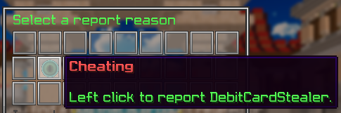
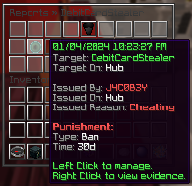

# Reports and requests

Players report rule-breakers with `/report` and ask staff for help with
`/request`. Both land in a queue staff work through in game, and reports are
grouped by category so the queue stays readable.

## Reporting

`/report <player>` opens a menu of report categories. Each category carries a
punishment ladder, so a staff member acting on the report already has the right
punishment path in front of them rather than choosing one from scratch.

Menus

## The queue

Command | Permission | Description
------- | ---------- | -----------
`/reports <player>` | `core.command.reports` | Reports made against one player.
`/reports all` | `core.command.reports.all` | Every open report on the network.
`/reports watchlist` | `core.command.reports.watchlist` | Players reported often enough to be worth a look.
`/reports stats [days]` | `core.command.reports.stats` | How the queue has been going, with a staff leaderboard.

`/reports watchlist` is the one to check on a quiet shift — it surfaces players
who have accumulated reports without anyone acting on them yet. `/watchlist` is
the same view as its own command.

## Categories

Categories are what players pick from in `/report`. Each has an id, a display
name, an item, a description and a punishment ladder.

Command | Permission
------- | ----------
`/reports categories` | `core.command.reports.categories`
`/reports categories create <id> <ladder> <material> <display>` | `core.command.reports.categories`
`/reports categories delete <category>` | `core.command.reports.categories`
`/reports categories displayName <category> <display>` | `core.command.reports.categories`
`/reports categories material <category> <material>` | `core.command.reports.categories`
`/reports categories description <category>` | `core.command.reports.categories`
`/reports categories punishmentladder <category> <ladder>` | `core.command.reports.categories`

One permission covers viewing categories and editing them, so anyone who can see
the category list can also change it. The shipped preset places it at Admin.

## Requests

`/request <message>` asks staff for help without accusing anyone. Requests appear
to online staff rather than entering the report queue.

Command | Permission | Description
------- | ---------- | -----------
`/request <message>` | `core.command.request` | Ask staff for help.
`/requestmute <player>` | `core.command.requestmute` | Stop a player sending requests.

:::note Report abuse
`/requestmute` mutes a player's requests specifically, leaving normal chat alone.
Reach for it before a chat mute when someone is only spamming the queue.
:::
