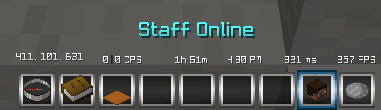
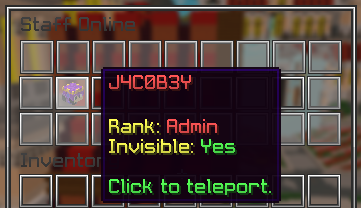

# Staff tools

The moderation tools staff use day to day — vanish, mod mode, freezing, chat
control — and the user-management commands behind them.

Reports and requests have their own page: [Features/Reports](/Phoenix/Features/Reports).

## Vanish

Vanish hides a staff member from players and from other staff below their rank.
Visibility is worked out per viewer, so a vanished admin is invisible to a helper
but not to another admin.

`/vanish` toggles your own; `/vanish <player>` needs `core.command.vanish.others`.
`/amivanished` answers the question without toggling anything.

`/hidestaff` is the other direction — it hides *other* staff from you, for when
you want to see the server the way a player does.

## Mod mode

Mod mode hands a staff member a set of moderation items and, if configured,
vanishes them at the same time. `/modmode <player>` puts someone else into it and
needs `core.command.modmode.others`.

Screenshots

## Freezing

`/freeze <player>` locks a player in place while you talk to them. `/setfreezeloc`
sets where frozen players are sent.

## Chat control

Command | Permission | Description
------- | ---------- | -----------
`/clearchat` | `core.command.clearchat` | Clear the chat.
`/mutechat` | `core.command.mutechat` | Stop players talking.
`/slowchat <seconds>` | `core.command.slowchat` | Put a delay between messages.
`/deletemessage` | `core.command.deletemessage` | Remove a single message.
`/socialspy` | `core.command.socialspy` | Read private messages.

Each has a matching bypass — `core.clearchat.bypass`, `core.mutechat.bypass`,
`core.slowchat.bypass` — which staff hold so they can keep working through a
lockdown. These are separate from `core.antispam.bypass` and
`core.cooldowns.bypass`, which skip the permanent chat and command delays and are
reasonable to sell to donors.

## Staff commands

`<>` = Required `[]` = Optional

Command | Permission | Description
------- | ---------- | -----------
`/vanish [player]` | `core.command.vanish` | Vanish yourself or another player.
`/amivanished` | `core.command.vanish` | Check whether you are vanished.
`/hidestaff` | `core.command.hidestaff` | Hide other staff from yourself.
`/modmode [player]` | `core.command.modmode` | Toggle mod mode.
`/freeze <player>` | `core.command.freeze` | Freeze a player in place.
`/setfreezeloc` | `core.command.setfreezeloc` | Set where frozen players are sent.
`/invsee <player>` | `core.command.invsee` | Open a player's inventory.
`/stafflist` | `core.command.stafflist` | Staff online across the network.
`/staffactivity` | `core.command.staffactivity` | How active each staff member has been.
`/staffhistory <player>` | `core.command.staffhistory` | Punishments a staff member has issued.
`/staffrollback <player>` | `core.command.staffrollback` | Reverse a staff member's punishments.
`/togglestaff` | `core.command.togglestaffmessages` | Mute staff messages for yourself.
`/adminprofile <player>` | `core.command.adminprofile` | Open a player's admin profile.

## User Management Commands

`<>` = Required `[]` = Optional

Command                                                    | Permission                           | Description
---------------------------------------------------------- | ------------------------------------ | ----------------------------------
`/user clearalts <player> [recursive]`                     | `core.command.user.clearalts`        | Clear a player's alts.
`/user clearcooldowns <player>`                            | `core.command.user.clearcooldowns`   | Clear a player's cooldowns.
`/user cleargrants <player>`                               | `core.command.user.cleargrants`      | Clear a player's grants.
`/user clearips <player>`                                  | `core.command.user.clearips`         | Clear a player's encrypted IPs.
`/user clearpunishments <player>`                          | `core.command.user.clearpunishments` | Clear a player's punishments.
`/user delete <player>`                                    | `core.command.user.delete`           | Delete a users profile.
`/user disguise <player> [rank]`                           | `core.command.user.disguise`         | Disguise a player as a rank.
`/user info <player>`                                      | `core.command.user.info`             | View a users information.
`/alts lookup <ip> [page]`                               | `core.command.alts.lookup`         | Search for players by IP.
`/user perm add <player> <permission> <duration> [scopes]` | `core.command.user.addperm`          | Add a permission to a player.
`/user perm clear <player>`                                | `core.command.user.clearperm`        | Clear a player's permissions.
`/user perm delete <player> <permission>`                  | `core.command.user.removeperm`       | Remove a permission from a player.
`/user perm list <player> [page]`                          | `core.command.user.listperm`         | View permissions of player.
`/user perm search <permission> [page]`                    | `core.command.user.searchperm`       | Search for a permission.
`/user staffinfo <player>`                                 | `core.command.user.staffinfo`        | View a users staff information.
